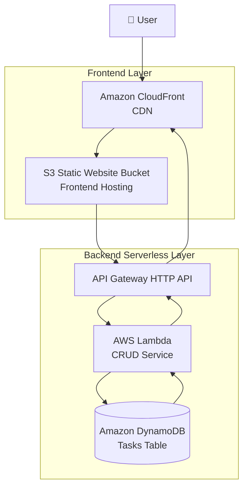
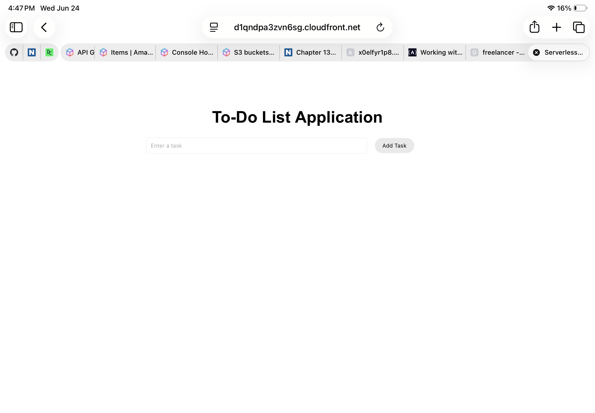
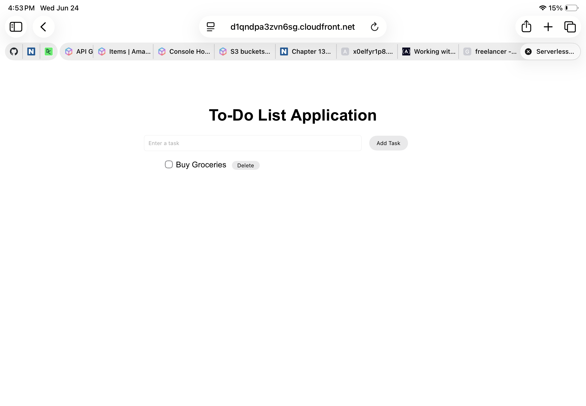
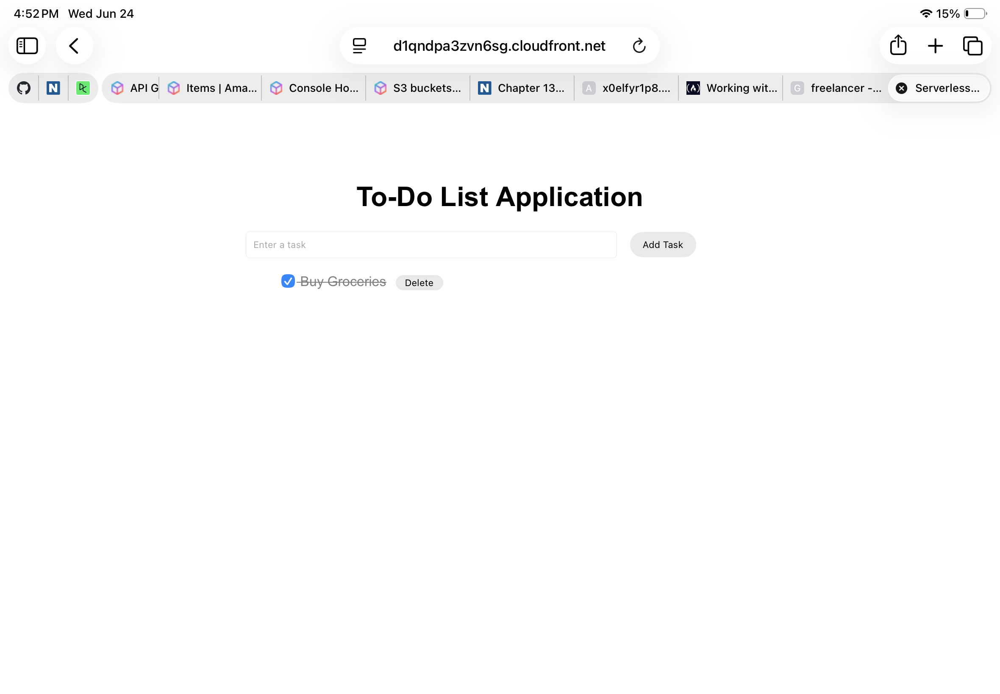

# AWS-Serverless-ToDoTasks-App  

## Overview

A fully serverless To-Do List Application built using AWS cloud services. The application allows users to create, view, update, and delete tasks through a web interface hosted on Amazon S3. The backend is powered by AWS Lambda, API Gateway, and DynamoDB, providing a scalable and cost-effective serverless architecture.

---

## Features

* Add new tasks
* View all tasks
* Mark tasks as completed
* Delete tasks
* Persistent storage using DynamoDB
* Fully serverless architecture
* Secure HTTPS frontend delivery via CloudFront

---

## Architecture


---

## Tech Stack

* Frontend: HTML, CSS, JavaScript
* Backend: AWS Lambda (Python)
* Database: Amazon DynamoDB
* API Layer: Amazon API Gateway (HTTP API)
* Hosting: Amazon S3 Static Website Hosting
* CDN & Security: Amazon CloudFront (HTTPS)

---

## API Endpoints

| Method | Endpoint        | Description              |
| ------ | --------------- | ------------------------ |
| POST   | /tasks          | Create a new task        |
| GET    | /tasks          | Retrieve all tasks       |
| PUT    | /tasks/{taskId} | Mark a task as completed |
| DELETE | /tasks/{taskId} | Delete a task            |

---

## DynamoDB Table Design

**Table Name:** Tasks

| Attribute | Type                   |
| --------- | ---------------------- |
| taskId    | String (Partition Key) |
| task      | String                 |
| completed | Boolean                |

Example Item:

```json
{
  "taskId": "2fc16bec-333a-4d25-b52c-e063c1a9aa20",
  "task": "Buy groceries",
  "completed": false
}
```

---

## Implementation Steps

**Step 1:**  
Created a DynamoDB table to store tasks.
**Step 2:**  
Developed an AWS Lambda function to handle CRUD operations.
**Step 3:**  
Configured API Gateway HTTP API routes.
**Step 4:**  
Implemented task creation, retrieval, update, and deletion logic.
**Step 5:**  
Built a responsive frontend using HTML, CSS, and JavaScript.
**Step 6:**  
Hosted the frontend on Amazon S3 Static Website Hosting.
**Step 7:**  
Integrated CloudFront for secure HTTPS delivery.  
**Step 8:**  
Connected the frontend to backend APIs using the Fetch API.
**Step 9:**  
Configured CORS for secure browser access.

---

## Screenshots

### Website Homepage



### Add-Task



### Add-Task-Dynamo-table


### Mark-Task-Completed



### Mark-Task-Completed-Dynamo-Table


### Delete-Task


### Delete-Task-Dynamo-Table


---

## Repository Structure

```text
aws-serverless-todo-app/
├── frontend/
│   └── index.html
├── lambda/
│   └── lambda_function.py
├── screenshots/
├── README.md
```

---

## Security Best Practices

* Implemented serverless architecture to minimize infrastructure management.
* Used API Gateway as the single entry point to backend services.
* Enabled CORS configuration for browser access.
* Stored application data securely in DynamoDB.
* Utilized IAM roles for Lambda permissions.
* Used CloudFront to ensure secure data transfer and prevents HTTP-based access issues.

---

## Skills Demonstrated

* AWS Lambda
* Amazon API Gateway
* Amazon DynamoDB
* Amazon S3 Static Website Hosting
* Python
* JavaScript
* Amazon CloudFront 
* Serverless Architecture
* Cloud Security Fundamentals

---

## Project Outcome

Successfully developed and deployed a fully functional serverless task management application capable of performing CRUD operations while leveraging AWS managed services for scalability, reliability, and cost efficiency.

---

## Future Enhancements

* User authentication with Amazon Cognito
* Task priorities and due dates
* Search and filter functionality
* Infrastructure as Code using AWS SAM or Terraform
* Responsive mobile-first UI enhancements
